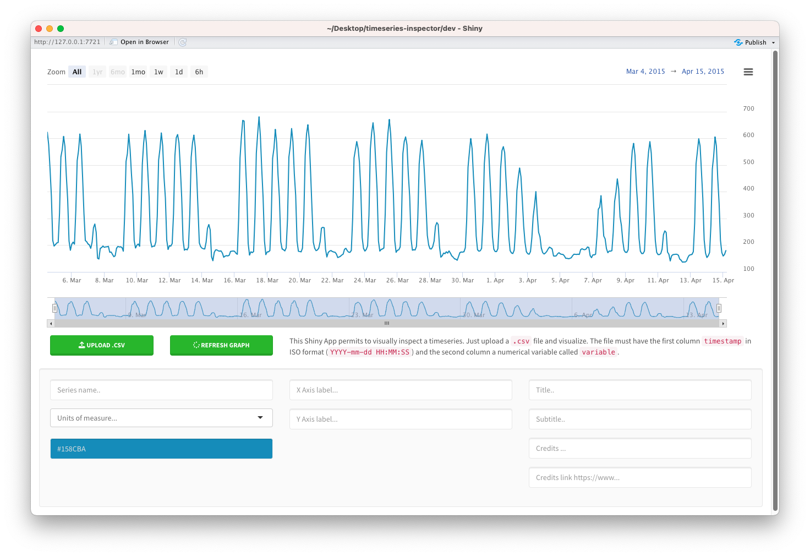

<!-- README.md is generated from README.Rmd. Please edit that file -->

# Time Series Inspector

<!-- badges: start -->

[](https://lifecycle.r-lib.org/articles/stages.html#experimental)
[](https://shields.io/)
<!-- badges: end -->

The goal of is to provide an easy interface to explore timeseries. The
inspector tool is embedded in the `TSinspector` package that can be
downloaded and installed locally or accessible online on shinyapps.io.



## Install and use as R package

You can install the development version from
[GitHub](https://github.com/) with:

``` r
# install.packages("devtools")
devtools::install_github("RobertoChiosa/timeseries-inspector")
```

This is a basic example which shows you how to solve a common problem:

``` r
library(TSinspector)
TSinspector::run_app()
```

## Install and use through docker container

In order to build the container image, you’ll need to use a `Dockerfile`. A Dockerfile is simply a text-based file with
no
file extension. In this case it was automatically created from the R console by using the `golem` command:

``` r
golem::add_dockerfile()
```

The Dockerfile is then added to the root folder of the application and contains all the instructions to build the
container.

However a more reliable way to create the Dockerfile is by using the function 
``` r
golem::add_dockerfile_with_renv()
```
This allows to generate the Dockerfile by leveraging the renv package which allows a more reliable way to handle dependencies in the R environment and acts like the venv in python environments. 

### Build the container image.

To build the image run the following command into the main folder of the application.


``` docker
docker build -f Dockerfile --progress=plain -t timeseries-inspector .
```

Troubleshooting on mac M1

``` bash
docker build -f Dockerfile --progress=plain -t timeseries-inspector . --platform linux/x86_64
```

The `-t` flag tags specifies a human-readable name for the final image. Since you named
the image `timeseries-inspector`, you can refer to that image when you run a container.

The `.` at the end of the docker build command tells Docker that it should look for the Dockerfile in the current directory.

The first time you build the image Docker downloads a lot of layers because you instructed the builder that you
wanted to start from the `rocker/verse:4.2.2` image. But, since you didn’t have that on your machine, Docker needed to
download the image. Once the installation of the base image is done any further build will be much faster.

### Run the container image.

Then run the application by starting the container.
``` bash
docker run  --name TSinspector -p 80:80 timeseries-inspector:latest
```

After a few seconds, open your web browser to http://127.0.0.1/80. You should see your app.


