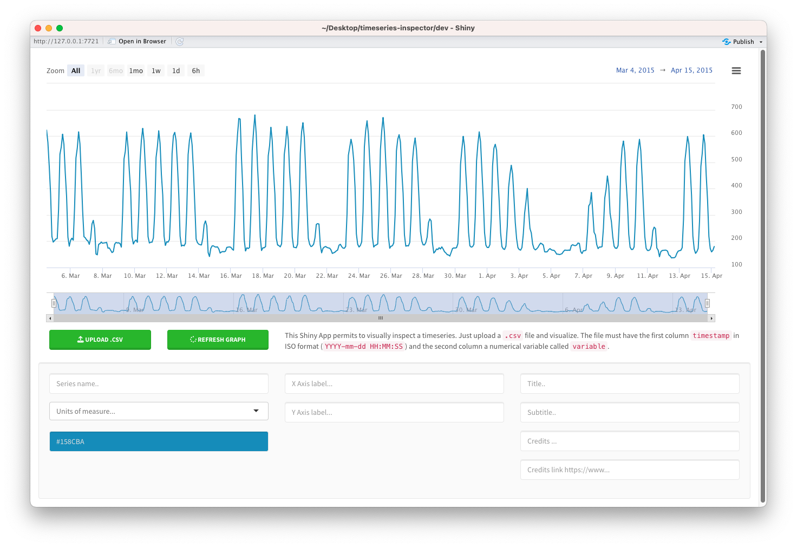

<!-- README.md is generated from README.Rmd. Please edit that file -->

# Time Series Inspector

<!-- badges: start -->

[](https://lifecycle.r-lib.org/articles/stages.html#experimental)
[](https://shields.io/)
<!-- badges: end -->

The goal of is to provide an easy interface to explore timeseries. The
inspector tool is embedded in the `TSinspector` package that can be
downloaded and installed locally or accessible online on shinyapps.io.



## Installation

You can install the development version from
[GitHub](https://github.com/) with:

``` r
# install.packages("devtools")
devtools::install_github("RobertoChiosa/timeseries-inspector")
```

## Usage

This is a basic example which shows you how to solve a common problem:

``` r
library(TSinspector)
#> Registered S3 method overwritten by 'quantmod':
#>   method            from
#>   as.zoo.data.frame zoo
# TSinspector::run_app()
```
